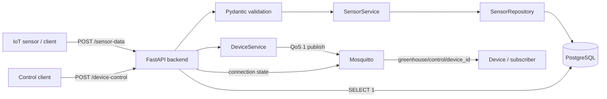

# Greenhouse IoT Backend

A production-oriented backend technical test for greenhouse sensor ingestion and
device control. The service accepts sensor readings over HTTP, stores them in
PostgreSQL, publishes ON/OFF commands to Mosquitto, and reports live dependency
health.

The complete stack starts with one command and does not require a local Python,
PostgreSQL, or Mosquitto installation.

## Architecture



Sensor ingestion and device control intentionally use different paths:

- Sensor telemetry enters through HTTP and is persisted in PostgreSQL.
- Device commands enter through HTTP and are published to MQTT.
- `GET /status` performs a real database query and reads the MQTT client's live
  connection state.

## Technology stack

| Component | Technology | Purpose |
| --- | --- | --- |
| HTTP API | FastAPI | Routing, dependency injection, OpenAPI, lifecycle |
| Validation | Pydantic | Strict request and response contracts |
| Database | PostgreSQL 16 | Durable sensor storage |
| ORM | SQLAlchemy 2 | Models, sessions, connection pooling |
| Migrations | Alembic | Versioned and repeatable schema changes |
| MQTT | Mosquitto 2 + Paho MQTT | Real-time device commands |
| Runtime | Python 3.12 + Uvicorn | Application execution |
| Packaging | Docker Compose | Reproducible three-service environment |
| Tests | Pytest + HTTPX | API, service, validation, and failure behavior |

## Project structure

```text
.
|-- app/                    # FastAPI application and lifecycle
|-- api/                    # HTTP routes and shared dependencies
|-- core/                   # Settings and application exceptions
|-- database/               # SQLAlchemy base, model, engine, sessions
|-- migrations/             # Alembic environment and revisions
|-- mqtt/                   # Long-lived Paho MQTT client
|-- repositories/           # Database persistence operations
|-- schemas/                # Pydantic API contracts
|-- services/               # Sensor, device, and health business flows
|-- scripts/                # Independent database/MQTT diagnostics
|-- tests/                  # Automated tests
|-- mosquitto/              # Local broker configuration
|-- API_CONTRACT.md         # Frozen request/response contract
|-- DESIGN_DECISIONS.md     # Architectural rationale and trade-offs
|-- Dockerfile              # Backend image
|-- docker-compose.yml      # Backend, PostgreSQL, Mosquitto
`-- requirements.txt        # Python dependencies
```

## Quick start for reviewers

Prerequisite: Docker Desktop or Docker Engine with Compose v2.

```bash
git clone <repository-url>
cd greenhouse-backend
cp .env.example .env
docker compose up --build
```

PowerShell equivalent for the copy step:

```powershell
Copy-Item .env.example .env
docker compose up --build
```

Compose starts the services in dependency order:

1. PostgreSQL starts and passes `pg_isready`.
2. Mosquitto starts and passes a publish healthcheck.
3. The backend runs `alembic upgrade head` automatically.
4. Uvicorn starts after the migration succeeds.

Once running:

- Swagger UI: <http://localhost:8000/docs>
- OpenAPI JSON: <http://localhost:8000/openapi.json>
- Health endpoint: <http://localhost:8000/status>

Run in the background if preferred:

```bash
docker compose up -d --build
docker compose ps
docker compose logs -f backend
```

Stop the stack without deleting database data:

```bash
docker compose down
```

`docker compose down -v` also deletes the PostgreSQL and Mosquitto volumes and
should only be used when a complete local reset is intended.

## Environment variables

`.env` is excluded from version control. `.env.example` contains safe local
development placeholders.

| Variable | Purpose | Example |
| --- | --- | --- |
| `POSTGRES_DB` | Database created by PostgreSQL | `greenhouse` |
| `POSTGRES_USER` | PostgreSQL application user | `greenhouse` |
| `POSTGRES_PASSWORD` | Local database password | `change-me` |
| `POSTGRES_HOST_PORT` | PostgreSQL port exposed to the host | `5432` |
| `DATABASE_URL` | URL used when running Python directly on the host | `postgresql+psycopg://...@localhost:5432/greenhouse` |
| `DATABASE_CONNECT_TIMEOUT_SECONDS` | Maximum wait for a new DB connection | `3` |
| `MQTT_HOST` | Broker used when running Python on the host | `localhost` |
| `MQTT_PORT` | Broker port seen by the backend | `1883` |
| `MQTT_HOST_PORT` | Broker port exposed to the host | `1883` |
| `BACKEND_PORT` | API port exposed to the host | `8000` |

Inside Compose, `DATABASE_URL` and `MQTT_HOST` are overridden to use the service
names `postgres` and `mosquitto`. Host tools such as DBeaver continue to use
`localhost`.

## API documentation

The stable contract is also recorded in [`API_CONTRACT.md`](API_CONTRACT.md).

### `GET /`

Lightweight process response:

```json
{
  "message": "Greenhouse IoT Backend is running"
}
```

### `POST /sensor-data`

Validates and stores one sensor reading.

```bash
curl -X POST http://localhost:8000/sensor-data \
  -H "Content-Type: application/json" \
  -d '{
    "device_id": "sensor-001",
    "temperature": 28.5,
    "humidity": 71.2,
    "timestamp": "2026-09-19T10:30:00Z"
  }'
```

Success: `201 Created`

```json
{
  "success": true,
  "message": "Sensor data stored successfully",
  "data": {
    "id": 1
  }
}
```

Validation rules:

- `device_id` is required, trimmed, 1-100 characters, and may contain letters,
  numbers, `.`, `_`, and `-`.
- `temperature` must be a JSON number. Numeric strings and booleans are rejected.
- `humidity` must be a JSON number from `0` through `100`.
- `timestamp` must be a timezone-aware RFC 3339 timestamp.
- Unknown fields are rejected.

### `POST /device-control`

Validates and publishes one device command.

```bash
curl -X POST http://localhost:8000/device-control \
  -H "Content-Type: application/json" \
  -d '{
    "device_id": "fan-001",
    "command": "ON"
  }'
```

Success: `200 OK`

```json
{
  "success": true,
  "message": "Device control command published successfully",
  "data": {
    "device_id": "fan-001",
    "command": "ON"
  }
}
```

`command` is case-sensitive and only accepts `ON` or `OFF`. Success confirms
broker acknowledgement, not execution by a physical device.

### `GET /status`

Healthy response:

```json
{
  "status": "healthy",
  "services": {
    "backend": "up",
    "database": "connected",
    "mqtt": "connected"
  }
}
```

If a dependency is unavailable, the endpoint remains `200 OK` but reports the
overall state as `degraded`:

```json
{
  "status": "degraded",
  "services": {
    "backend": "up",
    "database": "connected",
    "mqtt": "disconnected"
  }
}
```

`database` is derived from a live `SELECT 1`; `mqtt` is derived from Paho
connection callbacks. Neither value is hardcoded.

## MQTT integration

Topic convention:

```text
greenhouse/control/{device_id}
```

Example topic and payload:

```text
greenhouse/control/fan-001
```

```json
{
  "device_id": "fan-001",
  "command": "ON",
  "timestamp": "2026-09-19T10:35:00Z"
}
```

The backend creates one MQTT client during FastAPI startup, keeps its network loop
alive across requests, and disconnects it during shutdown. Commands use QoS 1 and
wait for the broker acknowledgement. Retain is disabled so a reconnecting device
does not receive a stale control instruction.

Standalone subscriber:

```bash
docker compose exec mosquitto mosquitto_sub \
  -h localhost \
  -t "greenhouse/control/#" \
  -q 1 \
  -v
```

## Database schema

Alembic owns schema creation. The backend entrypoint applies pending migrations
automatically.

Table `sensor_readings`:

| Column | Type | Meaning |
| --- | --- | --- |
| `id` | Integer, primary key | Server-generated reading identifier |
| `device_id` | Varchar(100) | Sensor that produced the reading |
| `temperature` | Float | Reported temperature |
| `humidity` | Float | Reported relative humidity |
| `recorded_at` | Timestamp with timezone | When the sensor took the measurement |
| `created_at` | Timestamp with timezone | When PostgreSQL stored the row |

`device_id` and `recorded_at` are indexed. Keeping both timestamps makes network
or queue delay observable.

Inspect data with SQL:

```bash
docker compose exec postgres psql \
  -U greenhouse \
  -d greenhouse \
  -c "SELECT * FROM sensor_readings ORDER BY id DESC;"
```

For DBeaver, use host `localhost`, port `POSTGRES_HOST_PORT`, and the database,
username, and password from `.env`. Navigate to
`Schemas -> public -> Tables -> sensor_readings`.

## Error handling and edge cases

All API errors share one envelope:

```json
{
  "success": false,
  "error": {
    "code": "MQTT_UNAVAILABLE",
    "message": "MQTT broker is unavailable"
  }
}
```

Stable codes include:

| Code | HTTP status | Condition |
| --- | --- | --- |
| `VALIDATION_ERROR` | 422 | Malformed JSON, missing/invalid/unknown field |
| `DATABASE_UNAVAILABLE` | 503 | Sensor persistence cannot reach PostgreSQL |
| `MQTT_UNAVAILABLE` | 503 | Broker disconnected or QoS 1 publish not acknowledged |
| `HTTP_ERROR` | Varies | Framework-level errors such as an unknown route |
| `INTERNAL_SERVER_ERROR` | 500 | Unexpected internal failure |

Validation responses add safe field-level `details`. Database URLs, passwords,
driver errors, and stack traces are only written to internal logs.

Important edge behavior:

- A database failure rolls back the sensor transaction.
- A broker failure never returns a false command success.
- The health endpoint reports partial failure while the backend remains available.
- The MQTT client reconnects automatically after an unexpected disconnect.
- QoS 1 may deliver duplicates; devices should make ON/OFF handling idempotent.

## Automated tests

Run tests inside the already running backend container:

```bash
docker compose exec backend python -m pytest -q
```

Or run locally with Python 3.11+:

```bash
python -m venv .venv
python -m pip install -r requirements.txt
pytest -q
```

The suite focuses on high-value behavior: valid persistence, malformed sensor
payloads, humidity bounds, structured QoS 1 commands, invalid commands, broker
failure, consistent errors, and healthy/degraded status responses.

For interactive HTTP testing, import the ready-to-use collection and environment
from [`postman/`](postman/) and follow [`POSTMAN_GUIDE.md`](POSTMAN_GUIDE.md).

Independent diagnostics:

```bash
python -m scripts.check_database
python -m scripts.check_mqtt_lifecycle
alembic check
```

## Manual end-to-end verification

With the stack running:

1. Start the MQTT subscriber shown above.
2. Send `POST /device-control`; confirm the structured event appears.
3. Send `POST /sensor-data`; inspect `sensor_readings` using DBeaver or `psql`.
4. Call `GET /status`; all services should be connected.
5. Run `docker compose stop mosquitto`; status should become degraded and device
   control should return `MQTT_UNAVAILABLE`.
6. Run `docker compose start mosquitto`; wait for automatic reconnection.
7. Run `docker compose stop postgres`; status should become degraded and sensor
   ingestion should return `DATABASE_UNAVAILABLE`.
8. Run `docker compose start postgres`; status should return to healthy.

## Design trade-offs

This submission intentionally uses one FastAPI service, one relational database,
and one MQTT broker. Redis, Kafka, Kubernetes, microservices, and AI components
would add operational surface without satisfying an assignment requirement.

The detailed rationale, partial-failure model, and production-scale evolution are
documented in [`DESIGN_DECISIONS.md`](DESIGN_DECISIONS.md).
